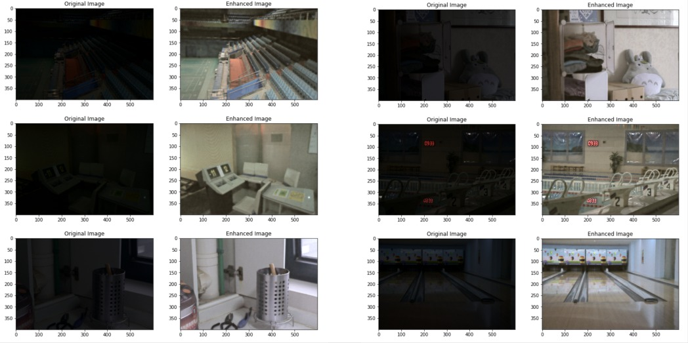
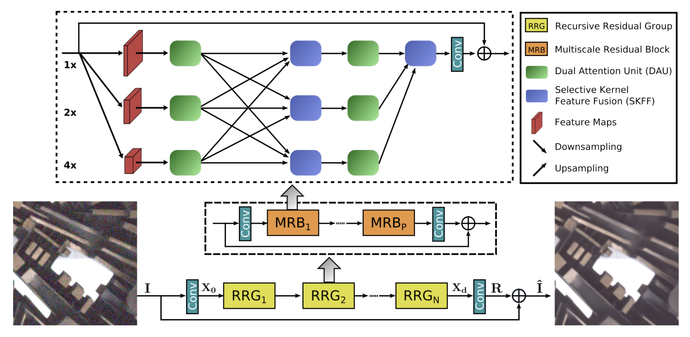

# MIRNet-TFJS [](https://twitter.com/intent/tweet?text=Wow:&url=https%3A%2F%2Fgithub.com%2FRishit-dagli%2FMIRNet-TFJS)

[](https://github.com/Rishit-dagli/MIRNet-TFJS/actions/workflows/main_mirnet-tfjs-demo.yml)
[](https://tfhub.dev/rishit-dagli/mirnet-tfjs/)
[](https://mybinder.org/v2/gh/Rishit-dagli/MIRNet-TFJS/HEAD)
[](https://colab.research.google.com/github/Rishit-dagli/MIRNet-TFJS)

[](LICENSE)

[](https://github.com/Rishit-dagli/MIRNet-TFJS/stargazers)
[](https://github.com/Rishit-dagli/MIRNet-TFJS/network/members)


*Featured on [TensorFlow.JS Show And Tell](https://youtu.be/BMza5yrwZ9s)*

This repository shows the TFJS model conversion and inference processes for the for the **MIRNet** model as proposed by [Learning Enriched Features for Real Image Restoration and Enhancement](https://arxiv.org/abs/2003.06792) by Zamir et al. This model is capable of enhancing low-light images upto a great extent.



Model training code and pre-trained weights are provided by Soumik through [this repository](https://github.com/soumik12345/MIRNet/).

## Table of contents

- [A bit about the architecture](#a-bit-about-the-architecture)
- [About the notebooks](#about-the-notebooks)
  * [`MIRNet_Saved_Model.ipynb`](#mirnet_saved_modelipynb)
  * [`MIRNet_TFJS.ipynb`](#mirnet_tfjsipynb)
  * [`MIRNet_Inference.ipynb`](#mirnet_inferenceipynb)
- [Running the TFJS Model, An example](#running-the-tfjs-model-an-example)
  * [Getting Started](#getting-started)
  * [Run online on Repl.it](#run-online-on-replit)
  * [Troubleshooting](#troubleshooting)
- [Want to Contribute 🙋‍♂️?](#want-to-contribute-%EF%B8%8F)
- [Want to discuss? 💬](#want-to-discuss-)
- [Contributors](#contributors)
- [License](#license)

## A bit about the architecture

The **MIRNet** presents a novel architecture with the collective goals of maintaining high-resolution representations through the entire network, and
receiving strong contextual information from the low-resolution representations.

The core of this approach is a multi-scale residual block containing the following key elements:
- parallel multi-resolution convolution streams for extracting multi-scale features
- information exchange across the multi-resolution streams
- spatial and channel attention mechanisms for capturing contextual information
- attention based multi-scale feature aggregation.


<p align="center">
<small>Framework of MIRNet</small>
</p>

The figure above shows the framework of the proposed network MIRNet that learns enriched feature representations for image restoration and enhancement.

## About the notebooks

### [`MIRNet_Saved_Model.ipynb`](MIRNet_Saved_Model.ipynb) 
[](https://mybinder.org/v2/gh/Rishit-dagli/MIRNet-TFJS/HEAD?filepath=MIRNet_Saved_Model.ipynb)
[](https://colab.research.google.com/github/Rishit-dagli/MIRNet-TFJS/blob/main/MIRNet_Saved_Model.ipynb)

This notebook shows the the process of downloading pre-trained weights for the MIRNet model and saving it as a `SavedModel`.

### [`MIRNet_TFJS.ipynb`](MIRNet_TFJS.ipynb) 
[](https://mybinder.org/v2/gh/Rishit-dagli/MIRNet-TFJS/HEAD?filepath=MIRNet_TFJS.ipynb)
[](https://colab.research.google.com/github/Rishit-dagli/MIRNet-TFJS/blob/main/MIRNet_TFJS.ipynb)

This notebook shows the the process of converting the `SavedModel` to the TFJS format we built in the prequel notebook for the MIRNet model. It also shows performing optimizations on this.

### [`MIRNet_Inference.ipynb`](MIRNet_Inference.ipynb) 
[](https://mybinder.org/v2/gh/Rishit-dagli/MIRNet-TFJS/HEAD?filepath=MIRNet_Inference.ipynb)
[](https://colab.research.google.com/github/Rishit-dagli/MIRNet-TFJS/blob/main/MIRNet_Inference.ipynb)

This notebook shows the the process of inferencing for the MIRNet model on a couple of low light photos.

## Running the TFJS Model, An example

The code for the example can be found under the [`example`](./example) folder in this repo. As of now this example is a very minimalistic one as you can see in the below image. The example website is deployed on the free tier of Azure App Services so inferences could take quite some time (90 seconds or so) when a lot of folks might be using it at the same time. Since this project deploys on the free tier of Azure App Services, the hosted website couldd go down when a lot of users might be trying it out and the easiest way would be to [follow the instructions](#getting-started) to do so on a GitHub Codespace or on your own machine where inferences would be a lot more faster.


### Getting Started

To get up and running with this example, run the following commands, make sure you have [Node.js](http://nodejs.org/) installed.

```sh
git clone git@github.com:Rishit-dagli/MIRNet-TFJS.git # or clone your own fork
cd MIRNet-TFJS
```

After cloning the repository you would need to download the 
[model variables file](https://github.com/Rishit-dagli/MIRNet-TFJS/releases/download/v0.1.0/variables.data-00000-of-00001) 
[](https://github.com/Rishit-dagli/MIRNet-TFJS/releases/download/v0.1.0/variables.data-00000-of-00001) and place it 
at [`example/model/variables/variables.data-00000-of-00001`](example/model/variables/variables.data-00000-of-00001), this step has been covered in the below commands however you 
can also do this through GUI. Run these commands after doing so:

```sh
wget -O ./example/model/variables/variables.data-00000-of-00001 https://github.com/Rishit-dagli/MIRNet-TFJS/releases/download/v0.1.0/variables.data-00000-of-00001
cd example # switch to the example folder
npm install
npm start
```

Your app should now be running on [localhost:3000](http://localhost:3000) :rocket:.

### Run online on Repl.it

Alternatively you could also get up and running with this example with the free to use online service Repl.it. Get started by clicking on this button [](https://repl.it/@RishitDagli/MIRNet-TFJS) after which you would click the Run button on the top or run `npm start` and voila your app is now running :rocket:.

### Troubleshooting

The [`example`](./example) folder has a standalone [`modeltest.js`](./example/modeltest.js) file, which tries to run the model on a specified file and then save the output to test the model. You can test the model with this file through:

```sh
git clone git@github.com:Rishit-dagli/MIRNet-TFJS.git # or clone your own fork
cd MIRNet-TFJS
cd example # switch to the example folder
npm install
node modeltest.js
```

The [`modeltest.js`](./example/modeltest.js) uses the `input.PNG` image file in the root directory and outputs a `output.Png` image file.

## Want to Contribute 🙋‍♂️?

Awesome! If you want to contribute to this project, you're always welcome! See [Contributing Guidelines](CONTRIBUTING.md). You can also take a look at [MIRNet-TFJS' Project Status Tracker](https://github.com/Rishit-dagli/MIRNet-TFJS/projects/1) for getting more information about current or upcoming tasks.

## Want to discuss? 💬

Have any questions, doubts or want to present your opinions, views? You're always welcome. You can [start discussions](https://github.com/Rishit-dagli/MIRNet-TFJS/discussions).

## Contributors

- [Rishit Dagli](https://github.com/Rishit-dagli)
- [Omkar Agrawal](https://github.com/omkaragrawal/)

## License

```
Copyright 2020 Rishit Dagli

Licensed under the Apache License, Version 2.0 (the "License");
you may not use this file except in compliance with the License.
You may obtain a copy of the License at

    http://www.apache.org/licenses/LICENSE-2.0

Unless required by applicable law or agreed to in writing, software
distributed under the License is distributed on an "AS IS" BASIS,
WITHOUT WARRANTIES OR CONDITIONS OF ANY KIND, either express or implied.
See the License for the specific language governing permissions and
limitations under the License.
```
